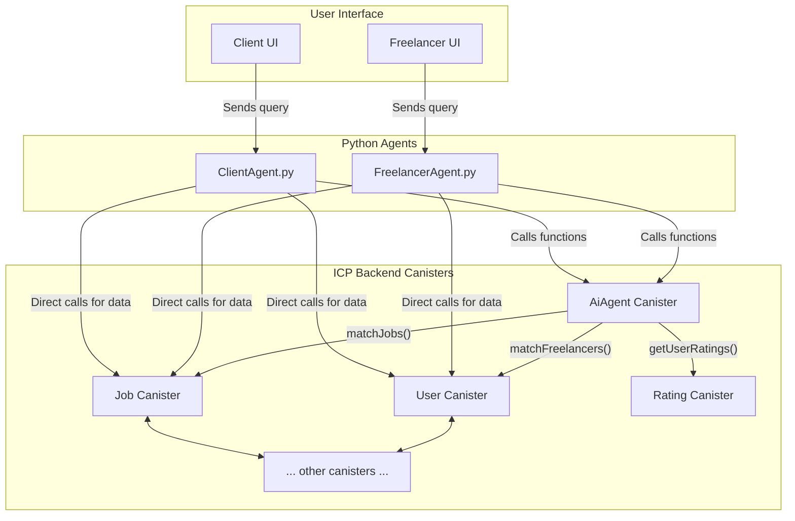

# AI Agent System Architecture

This diagram illustrates the architecture of the AI agent system, showing the relationships between the Python-based agents, the central `AiAgent` canister, and the other backend canisters.

This diagram shows:
-   **User Interface**: Separate UIs for freelancers and clients.
-   **Python Agents**: The `FreelancerAgent` and `ClientAgent` that process user queries.
-   **ICP Backend Canisters**: The core of the application, with the `AiAgent` canister acting as an orchestrator for complex logic, while the agents can also call other canisters directly for simple data retrieval.

With this diagram, we have a solid architectural foundation. I'll now update our todo list.